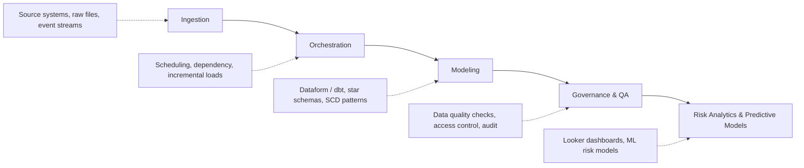

# Ketro Sithole

**Cloud Data Engineer** | Data & Risk Analytics
BSc Computer Science, University of Pretoria

I build data pipelines and platforms that support risk analytics and predictive modeling, with a background that also covers software engineering and data science. 4+ years of experience working across the full data lifecycle: ingestion, orchestration, modeling, and the governance that keeps it all trustworthy.

---

## How data moves through what I build

---

## Focus areas

**Data Engineering** *(primary)*
Building and maintaining reliable pipelines, batch and incremental, on cloud data warehouses, with an emphasis on data quality, observability, and scale.

**Data Science & Predictive Modeling**
Applying statistical methods and ML to turn historical data into forward-looking risk models.

**Software Engineering**
Backend systems and services that the data platforms run on.

**IT Risk & Governance**
Making data systems auditable and controlled, not just functional.

---

## Tech stack

**Languages**

  
  
  
  

**Platforms & tools**

  
  
  
  
  
  
  
  
  

---

## Contact

- LinkedIn: [linkedin.com/in/ketro-sithole](https://www.linkedin.com/in/ketro-sithole-76b8b1165/)
- GitHub: [github.com/KetroSithole](https://github.com/KetroSithole)
